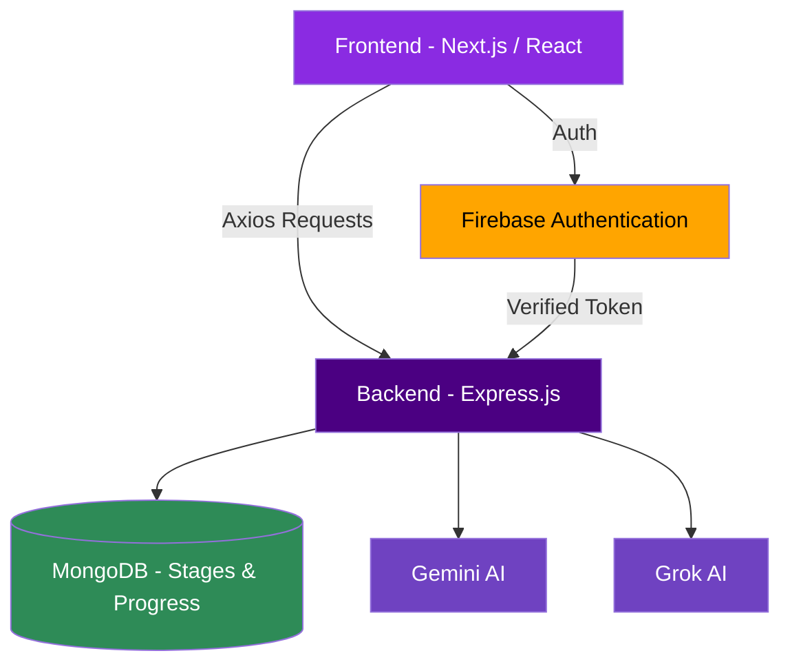
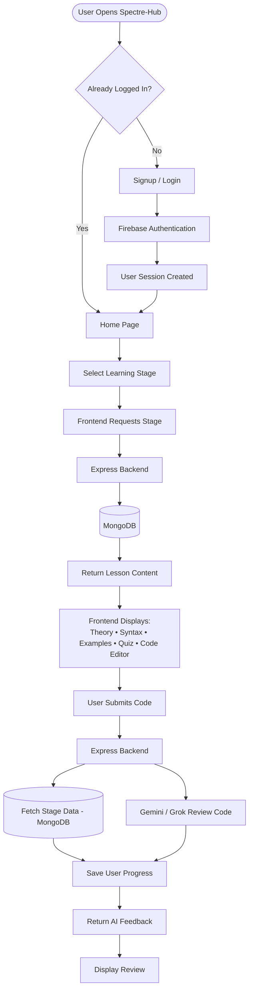
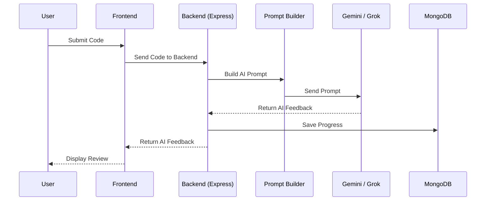
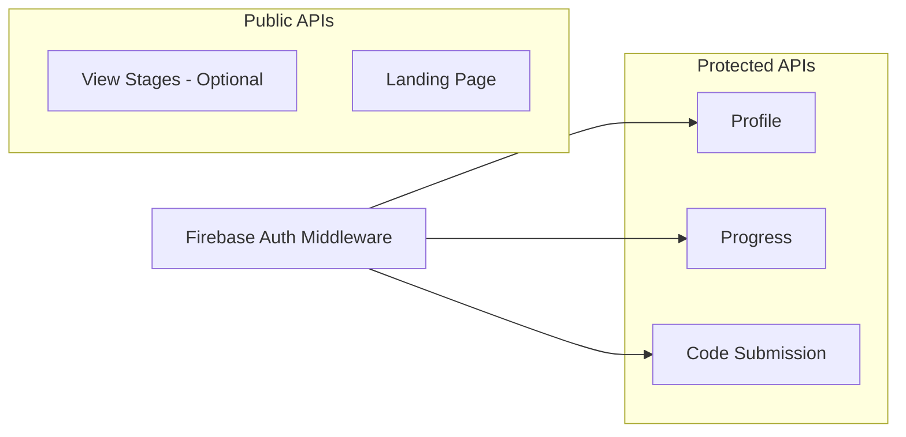

<div align="center">

# SPECTRE-HUB

### Learn Web Development 


<br/>

[](https://spectre-hub-frontend.vercel.app/)
[](#-license)
[](#)
[](#)
[](#)

[](#)
[](#)
[](#)


</div>

<p align="center">
  
</p>

---

## 📖 Table of Contents

- [About the Project](#-about-the-project)
- [Why Spectre-Hub](#-why-spectre-hub)
- [Features](#-features)
- [Tech Stack](#-tech-stack)
- [Architecture](#-architecture)
- [Application Workflow](#-application-workflow)
- [AI Review Flow](#-ai-review-flow)
- [Project Structure](#-project-structure)
- [MongoDB Collections](#-mongodb-collections)
- [Backend Responsibilities](#-backend-responsibilities)
- [Middleware & API Access](#-middleware--api-access)
- [Why MongoDB](#-why-mongodb)
- [Future Enhancements](#-future-enhancements)
- [Back to Top](#-spectre-hub)

---

## 🕯️ About the Project

> **Spectre-Hub** is an AI-powered web development learning platform designed to teach modern web development — from **HTML to Deployment** — through an immersive learning experience.

Unlike traditional learning platforms, Spectre-Hub first teaches concepts with **detailed explanations, syntax, examples, and quizzes** before assessing the learner with hands-on coding challenges. Every submitted solution is reviewed by **Gemini AI** , providing personalized feedback, improvements, and suggestions.

The platform tracks each learner's progress, allowing them to continue learning seamlessly while building a complete web development roadmap.

<div align="center">

### 🔗 [**Try the Live Demo →**](https://spectre-hub-frontend.vercel.app/)

</div>

---

## 🌟 Why Spectre-Hub

<table>
<tr>
<td width="33%" valign="top">

### 📚 Theory First
Every stage begins with complete theory, syntax references, and practical examples before any coding is required.

</td>
<td width="33%" valign="top">

### 🧠 AI-Powered Review
Submitted code is reviewed by **Gemini AI / Grok AI**, giving bug detection, best-practice suggestions, and code quality analysis.

</td>
<td width="33%" valign="top">

### 📊 Progress Tracking
A complete learning history — completed stages, AI review history, and profile progress — all in one place.

</td>
</tr>
</table>

---

## ✨ Features

<table>
<tr>
<th>Category</th>
<th>Details</th>
</tr>
<tr>
<td><b>🔐 Authentication</b></td>
<td>Firebase Authentication • Email & Password Login • Secure Signup • Persistent User Sessions</td>
</tr>
<tr>
<td><b>🎓 Learning Platform</b></td>
<td>HTML • CSS • JavaScript • React • Next.js • Node.js • Express.js • MongoDB • Firebase • REST APIs • Deployment</td>
</tr>
<tr>
<td><b>📦 Every Learning Stage Includes</b></td>
<td>Complete Theory • Syntax Reference • Practical Examples • Interactive Quiz • Coding Assessment • AI Code Review • Personalized Suggestions</td>
</tr>
<tr>
<td><b>🤖 AI Features</b></td>
<td>Code Review (Gemini AI / Grok AI) • Bug Detection • Best Practice Suggestions • Code Quality Analysis • Learning Feedback</td>
</tr>
<tr>
<td><b>👤 User Features</b></td>
<td>User Profile • Progress Tracking • Completed Stages • Learning History • AI Review History</td>
</tr>
</table>

---

## 🧰 Tech Stack

<div align="center">

### Frontend
   

`Next.js` &nbsp;•&nbsp; `React` &nbsp;•&nbsp; `Tailwind CSS` &nbsp;•&nbsp; `Axios` &nbsp;•&nbsp; `Monaco Editor`

### Backend
 

`Node.js` &nbsp;•&nbsp; `Express.js`

### Database


`MongoDB` &nbsp;•&nbsp; `Mongoose`

### Authentication


`Firebase Authentication`

### AI
`Gemini API` &nbsp;•&nbsp; `Grok API`

</div>

---

## 🏗️ Architecture



---

## 🔄 Application Workflow



---

## 🧪 AI Review Flow



---

## 📂 Project Structure

<details>
<summary><b>Click to expand full folder tree</b></summary>

```text
spectre-hub/
│
├── frontend/                                  # Next.js Frontend
│
│   ├── app/                                   # Application Pages
│   │
│   │   ├── page.js                            # Landing Page / Home
│   │
│   │   ├── login/
│   │   │     └── page.js                      # User Login
│   │
│   │   ├── signup/
│   │   │     └── page.js                      # User Signup
│   │
│   │   ├── profile/
│   │   │     └── page.js                      # User Profile & Progress
│   │
│   │   └── stages/
│   │         └── [slug]/
│   │               └── page.js                # Dynamic Learning Stage
│   │
│   ├── components/                            # Reusable UI Components
│   │
│   │   ├── Navbar.js                          # Navigation Bar
│   │   ├── Footer.js                          # Footer
│   │   ├── Button.js                          # Reusable Button
│   │   ├── Loader.js                          # Loading Spinner
│   │   ├── Card.js                            # Generic Card Component
│   │   ├── Lesson.js                          # Lesson Viewer
│   │   ├── SyntaxBox.js                       # Syntax Display
│   │   ├── ExampleBox.js                      # Code Examples
│   │   ├── Quiz.js                            # Quiz Component
│   │   ├── CodeEditor.js                      # Monaco Code Editor
│   │   ├── AIReview.js                        # AI Review UI
│   │   └── ProgressBar.js                     # User Progress
│   │
│   ├── context/
│   │     └── AuthContext.js                   # Firebase Authentication Context
│   │
│   └── services/
│         ├── api.js                           # Backend API Calls
│         └── firebase.js                      # Firebase Configuration
│
├── backend/                                   # Express Backend
│
│   ├── server.js                              # Backend Entry Point
│   │
│   ├── config/
│   │     ├── db.js                            # MongoDB Connection
│   │     └── ai.js                            # Gemini / Grok Configuration
│   │
│   ├── models/
│   │     ├── Stage.js                         # Learning Stages Schema
│   │     └── Progress.js                      # User Progress Schema
│   │
│   ├── routes/
│   │     ├── stage.js                         # Stage APIs & AI Review
│   │     └── user.js                          # User Profile & Progress APIs
│   │
│   ├── middleware/
│   │     └── firebaseAuth.js                  # Firebase Token Verification
│   │
│   └── utils/
│         └── promptBuilder.js                 # Builds AI Prompt
│
└── README.md
```

</details>

---

## 🗄️ MongoDB Collections

<table>
<tr>
<td width="50%" valign="top">

### 📘 Stages
Stores all learning content.

```text
Title
Slug
Description
Theory
Syntax
Examples
Quiz
Starter Code
Difficulty
XP Reward
```

</td>
<td width="50%" valign="top">

### 📗 Progress
Stores every user's learning progress.

```text
Firebase UID
Stage
Submitted Code
AI Feedback
Score
Completed
Last Attempt
```

</td>
</tr>
</table>

---

## ⚙️ Backend Responsibilities

<details>
<summary><b>📄 stage.js</b></summary>

- Fetching learning stages
- Returning lesson content
- Receiving submitted code
- Calling Gemini/Grok
- Saving progress

</details>

<details>
<summary><b>📄 user.js</b></summary>

- Returning profile information
- Returning completed stages
- Returning progress history

</details>

---

## 🔒 Middleware & API Access

> Firebase Authentication middleware protects private APIs.



| API Type | Endpoints |
|----------|-----------|
| 🔐 **Protected** | Profile, Progress, Code Submission |
| 🌍 **Public** | View Stages (Optional), Landing Page |

---

## 🧭 Why MongoDB?

> MongoDB stores all application data **except authentication**.

It stores:

- Learning Stages
- Lesson Content
- Examples
- Quizzes
- User Progress
- AI Feedback
- Submitted Code

Authentication is completely managed by **Firebase Authentication**, making the backend simpler and more secure.

---

## 🚀 Future Enhancements

> The following are planned ideas and are **not yet implemented**.

- [ ] Boss Battles
- [ ] XP System
- [ ] Daily Challenges
- [ ] Achievements
- [ ] AI Mentor
- [ ] Dark Mode Themes
- [ ] Streak Tracking
- [ ] Coding assessment

---

<div align="center">

### Learn Web Development. Survive the Curriculum.

[](https://spectre-hub-frontend.vercel.app/)

[⬆ Back to Top](#-spectre-hub)

</div>
